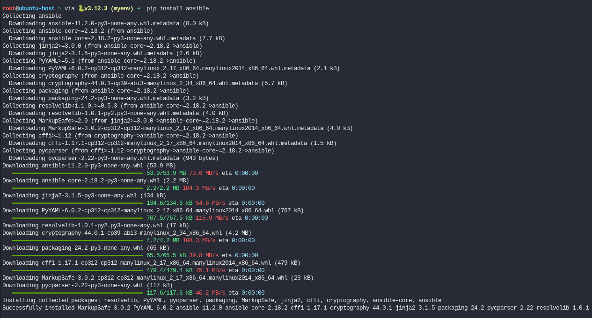
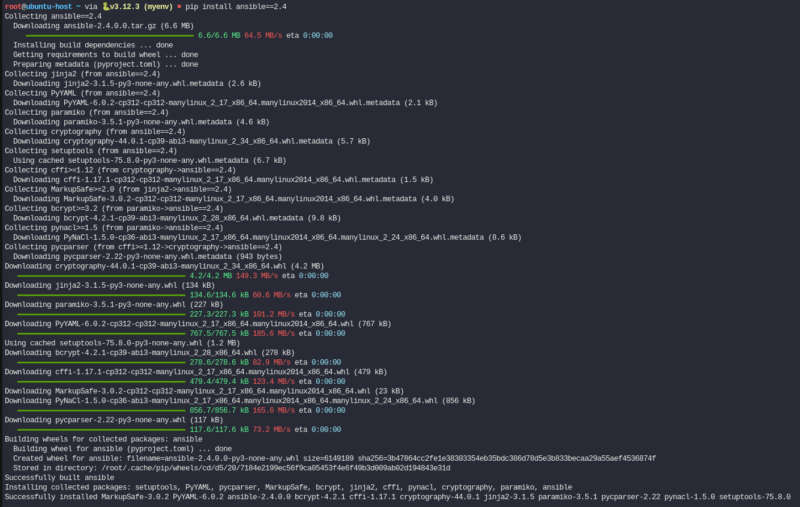
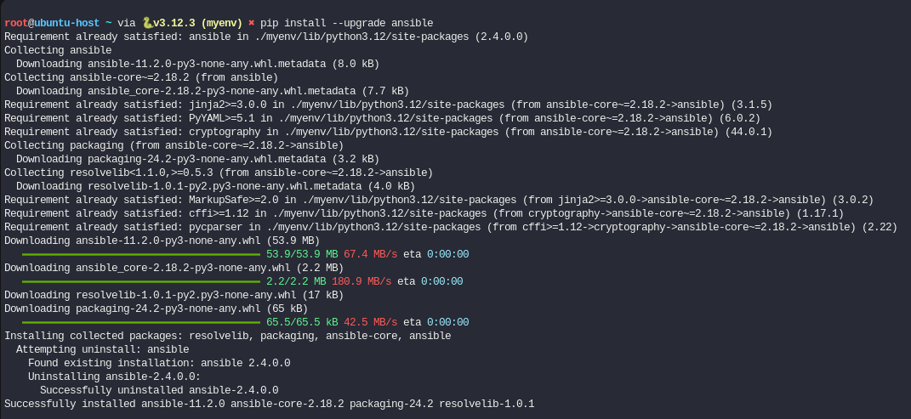

En la entrada anterior, titulada [Ansible - Laboratorio ](https://javi-rod.github.io/2024/09/Ansible-lab/) vimos como montar un laboratorio de Ansible con VirtualBox. En una de las partes explicaba cómo instalar Ansible en una máquina con el gestor de paquetes, pero hay otras formas de las que hablará a continuación.

Antes de continuar, vamos hablar de un concepto, el nodo de control. 

**Nodo de control**

El sistema dónde instalemos y configuremos Ansible, será el nodo de control, dónde se guardan los playbooks que creamos, los inventarios y los módulos (hablaremos de ello en futuros post)

Sólo se puede instalar en Linux, no podemos instalarlo directamente en Windows, aunque existen hacks para que funcione y no está soportado de forma oficial.

Ahora vamos hablar de las formas de **instalar Ansible**:

1. **Gestor paquetes** (puede que NO tengan la última versión de Ansible)

   * Redhat o CentOS: `sudo yum install ansible`

   * Fedora: `sudo dnf install ansible`

   * Debian/Ubuntu: `apt-get install ansible`

2. **Python**: 
 
   * Instalar: `sudo pip install ansible`

   

   * Instalar una versión específica: `sudo pip install ansible==2.4`

   

   * Actualizar: `pip install --upgrade ansible`

   

3. **Desde repositorio de GIT**

* 3.1 Instalar dependencias

    ```
    sudo apt-get update
    sudo apt-get install git python3-pip python3-venv
    ```

* 3.2 Clonar repositorio y cambiar al directorio

    ```
    git clone https://github.com/ansible/ansible.git
    cd ansible
    ```

* 3.3.Crear y activar un entorno virutal (aunque no es obligatorio lo recomiendan para aislar la instalación de Ansible)

    ```
    python3 -m venv myenv
    source myenv/bin/activate
    ```

* 3.4 Instalar Asible y dependencias

    ```
    pip install -r requirements.txt
    python3 setup.py install
    ```

* 3.5 Configurar variables de entorno (si fuera necesario)

    En caso de que haya algún problema al ejecutar los comandos de Ansible, puede que necesitemos añadir los binarios de Ansible a nuestro PATH

    ```
    export PATH=$PATH:/ruta/a/myenv/bin
    ```
    Usar un entorno virtual es una buena práctica para mantener el entorno de trabajo limpio y evitar conflictos con otras dependencias de Python.

4. **Construir tus propios RPM descargando el código**

**Consideraciones**:

* Cuando Ansible se instala con un gestor de paquetes crea un fichero de inventario por defecto en la ubicación de hosts ( `/etc/ansible/hosts`) y un fichero de configuración por defecto en `/etc/ansible/ansible.cfg`

* Si al ejecutar un playbook no específicamos el fichero de inventario usara el de por defecto. 

* Podemos crear el fichero de inventario en cualquier ubicación, lo normal es que esté junto al playbook.

* En el caso de tener un fichero de configuración en el mismo directorio del playbook, anulará el comportamiento del fichero por defecto.

* Los anteriores ficheros por defecto, no se generan si instalamos Ansible con Python y tendremos que crearlos manualmente.