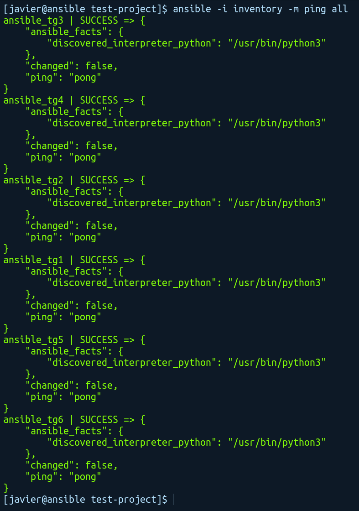
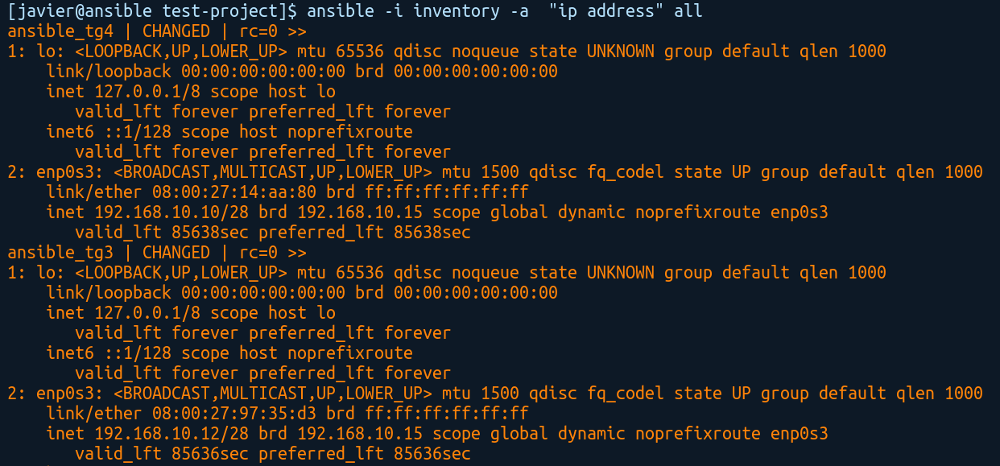

Un comando ad-hoc, en Ansible,  es una forma de ejecutar tareas simples o únicas en nuestros servidores sin necesidad de escribir un playbook. Es útil para realizar acciones inmediatas y puntuales, como reiniciar servicios, instalar paquetes, copiar archivos o verificar el estado de los sistemas.

Ejemplo

`ansible -i inventory -m ping all`

Indicamos con -i el inventario (si no se indica busca en */etc/ansible/hosts*) -m indica el módulo que usamos, en este caso ping y por último los servidores,en el ejemplo todos.

En este contexto, ping no es un ping ICMP, es una comprobación de que Ansible pueda conectarse a las máquinas objetivo por SSH usando las credenciales configuradas.

A continuación un ejemplo de la salida del comando anterior. Como veremos nos devuelve la información en formato JSON.

Una opción interesante, es ejecutar comandos para obtener información de los servidores. Para ello usamos el parámetro -a

Aquí tenemos un ejemplo de un comando ad-hoc ejecutando un comando en los servidores

`ansible -i inventory -a  “ip address” all`

Ejecutando lo anterior obtendremos las direcciones IP de las interfaces de red de todos los servidores.

