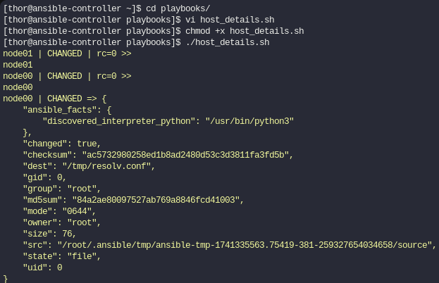
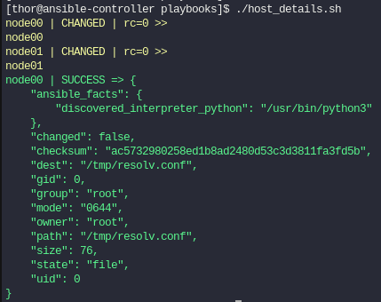
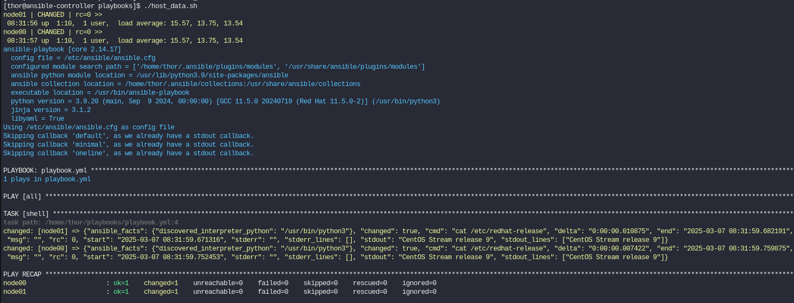

En el post anterior vimos que erán los comandos ad-hoc y para qué eran últiles. Pues bien, esos comandos podemos incluirlos en un script. A continuación veremos unos ejemplos de unos ejercicios, de cómo usar esos comandos en scripts de Bash.


#### Ejemplo 1

Crear un shell script *hots_details.sh* en *~/playbooks* y hacerlo ejecutable.

El script debe correr comandos ansible ad-hoc que hagan lo siguiente:

1. Imprimir el hostname de todos los nodos manejados en el fichero de inventario ubicado en  *~/playbooks/inventory*.

2. Usar el módulo copy para copiar /etc/resolv.conf desde el controlador de ansible a */tmp/resolv.conf* del host node00. Usar el inventario ubicado en *~/plabooks/inventory*

#### - Cambiar de directorio y crear el fichero hots_details.sh
```
cd playbooks/
vi host_details.sh
```
```bash
ansible all -a "hostname" -i inventory
ansible node00 -m copy -a "src=/etc/resolv.conf dest=/tmp/resolv.conf" -i inventory
```
#### - Dar permisos de ejecución al  fichero hots_details.sh
`chmod +x host_details.sh`

Esto es lo que veríamos al lanzar el script. Vemos que en el node00 hay un estado CHANGED y nos muestra los cambios.
 


Si volvemos a lanzar el script, vemos que ahora el node00 lo marca como SUCCESS,esto quiere decir que la tarea fue ejecutada con éxito pero sin necesidad de realizar cambios.


 
 #### Ejemplo 2
 
 Crear un shell script host_data.sh en en ~/playbooks y hacerlo ejecutable.
 
 El script debe:
 
1.  Establecer ANSIBLE_GATHERING en explicito

2.  Correr un comando ad-hoc que muestre el uptime de todos los nodos manejados del fichero  *~/playbooks/inventory*.

3. Crear y correr un playbook  *~/playbooks/playbook.yml* que haga un cat del fichero */etc/red-hat-release* de todos los nodos manejados del inventario ubicado en *~/playbooks/inventory*. El playbook tiene que ejecutarse en modo verbose usando -vv al final del comando de ansible-playbook.


#### - Crear playbook

`vi playbook.yml`

```yaml
---
- hosts: all
  tasks:
    - shell: cat /etc/redhat-release
```

#### - Crear Script

`vi host_data.sh`

```bash
export ANSIBLE_GATHERING=explicit
ansible all -m shell -a uptime -i inventory
ansible-playbook -i inventory playbook.yml -vv
```

#### - Dar permiso de ejecución al script

`chmod +x host_data.sh`

Si ejecutamos el script esto es lo que veremos. El uptime de los servidores node00 y node01 que tenemos en el inventario.


 
A continuación dejo posibles problemas que puedan surgir y como solucionarlos.

**- Errores en el inventario**:

  - Problema: Inventarios mal configurados o rutas incorrectas al archivo.

  - Solución: Usar el flag -i si procede para indicar la ruta del inventario y verificar la estructura del inventario.

**- Permisos insuficientes**:

  - Problema: Fallos al ejecutar tareas debido a permisos restringidos en los nodos (como copiar archivos o ejecutar comandos con privilegios).

  - Solución: Hacer uso de become: yes en el playbook o configurar el acceso SSH con llaves y permisos adecuados.

**- Errores al copiar o crear archivos**:

  Problema: Fallos en módulos como copy o template cuando el destino no existe.

  Solución: Usar el módulo file para crear directorios necesarios antes de copiar archivos.

**- Problemas de conexión SSH**:

  - Problema: Conexiones fallidas a los nodos (timeout o autenticación).

  - Solución: Verificar claves públicas/privadas, probar con ansible -m ping y ajustar variables como ansible_ssh_port o ansible_user.

**- Sintaxis YAML o Bash**:

  - Problema: Errores en los scripts debido a errores de sintaxis o formato.

  - Solución: Usar herramientas como *ansible-lint* para YAML o *shellcheck* para Bash.

**- Depuración y diagnóstico**:

  - Sugerencia: Usar modos de depuración como `-vv` o `-vvvv` y logs para investigar errores en profundidad.

    Para habilitar los logs y que se guarde la salida en un archivo debemos hacer uso de la variable de entorno `ANSIBLE_LOG_PATH`

    Ejemplo:
    ```bash
    export ANSIBLE_LOG_PATH=~/playbooks/ansible_debug.log
    ```

    Con esta configuración, toda la salida de Ansible se almacenará en `ansible_debug.log`. Lo cual será útil para analizar grandes volúmenes de datos o errores complejos.
